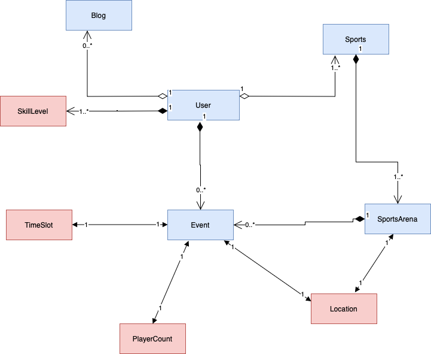

# Final Project : Play Mate

## Description 

PlayMate: Elevate your sporting experience

Welcome to PlayMate a web application that extends beyond traditional sports interaction, you can immerse yourself in the ultimate sports and fitness community. Explore a world where fitness fanatics, atheletes, and enthusiasts come together to share their love of an active lifestyle.

PlayMate is an easy-to-use application that allows you to discover and participate in a wide variety of sports and fitness activities with ease. Regardless of your sport preferences like team sports, individual training, or group events, this app serves as your entryway to a thriving community that embraces movement.

By being part of the PlayMate ecosystem, you can quickly book your prefered sports facilities, and arrange team events. Keep up with the current sport scene through reading blogs and creating your own to display your knowledge & interest, showcase your accomplishments, and participate in stimulating conversations with a vibrant community that understand the thrill of the game.

## Features

### User Authentication

- Users securely sign in using existing credentials, and new users can easily create accounts with a sign-up tool. 
- A secure password reset option is available for users who forget their passwords, ensuring account access without compromising security.

### Landing/Home Page

- Use the navbar to easily navigate the website and view your user profile, locations, and available venues. 
- Keep track of forthcoming events in a special section. 
- Create your own event with ease with a simple approach.
 
### Personalized Profile Creation

- Effortlessly register and create a unique profile on the site, customizing the experience. 
- Add multiple sports with skill level designation (beginner, moderate, expert). 
- Specify frequency of participation (daily, weekly, monthly) for each sport, providing comprehensive insights. 
- Tailor your profile to individual sporting preferences and skill levels.

### Booking courts/playgrounds

- Discover and book nearby courts/playgrounds. 
- View location, sport, and available time slots. 
- Easily book for a specific date and time.

### Notifications 

- Get email notifications for account registration, reset password link, and booking confirmations.

### Blog Posts

- Read and write a blog with title and description in the dedicated tab.

### Upcoming Events

- Instantly view upcoming events on page load. 
- Expand to see monthly events with date, time, location, and additional players.

### User Bookings

- Users can view thier active and past booking and will be able to update the active bookings.

## How to install and run the project

### Clone the git repository

1. **Clone the Repository:**

Command to clone the repository.
 ```
   $ git clone https://github.com/info-6150-fall-2023/final-project-playmate.git
 ```

### Configure the config.env file

1. **Create a file named config.env in the base folder**


2. **Create the following variable names:**
    - PORT (Port number for backend)
    - MONGO_URI (Mongo DB URI)
    - ACCESS_SECRET_TOKEN (Secret for Access Token)
    - REFERESH_SECRET_TOKEN (Secret for Referesh Token)
    - RESET_SECRET_TOKEN (Secret for Reset Token)
    - API_KEY (Google API key)

3. **Command to generate Secret keys for Access,Referesh, Reset Tokens**

    Generate the tokens and paste them in the respective variables
    ```
        node generateSecretKeys.js
     ```
3. **Steps to create and use the API key**
    - Create a google cloud account.
    - Go to the Google Maps Platform.
    - Open the credentials page.
    - Create credentials > API Key.
    - Once the API key is generated, paste it in the config file.
    - Make sure you enable the places library in the key configuration.


### Install dependencies in backend folder and start it

 1. **Command to install:**

 ```
    npm install
 ```

 2. **Command to run backend:**

 ```
    npm start
 ```

 3. **Backend will run on port 3000:**

### Install dependencies in frontend folder and start it

 1. **Navigate to frontend folder:**

 ```
    cd client/playmate-app
 ```

 2. **Command to install:**

 ```
    npm install
 ```

 3. **Command to run frontend:**

 ```
    npm start
 ```

 4. **Frontend will run on port 3001:**

Copy and paste the url in the browser
 ```
    http://localhost:3001/
 ```
 5. **PlayMate application homepage:**
 

## Object Model Using Domain Driven Design for PlayMate application



## Team Details

| Name | NEU Id | Email
| ---------|----------|----------|
| Nilraj Mayekar | 002866076 | mayekar.n@northeastern.edu |
| Anirudh Maheshwari | 002851954 | maheshwari.ani@northeastern.edu |
| Puja Kalivarapu | 002830506 | kalivarapu.p@northeastern.edu |
| Prachi Navale | 002294846 | navale.p@northeastern.edu |

